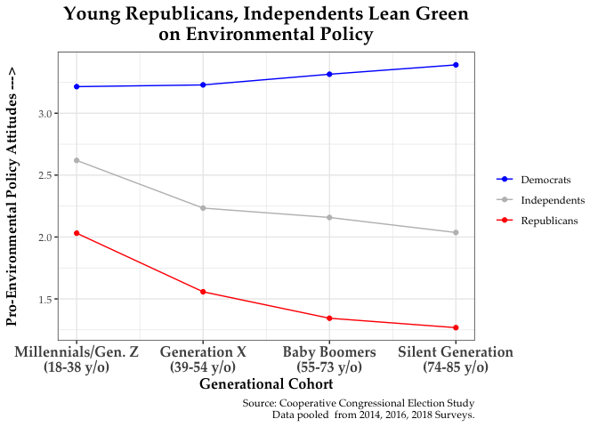

## Using the Cooperative Congressional Election Study for Data Analysis

Recent reports in the media highlight the increasingly "pro-environment" views among younger Americans. Younger generations are aware of climate changes and would like the government to take measures to address it. In particular, reports point to a supposed generational divergence within the Republican Party. Young Republicans are deviating from their older co-partisans and growing supportive of pro-environmental policy.

While the media often use a combination of anecdotes, quotes, and snippets from research, this question--are young Republicans more supportive of pro-environmental policy than their older co-partisans?---offers a good opportunity to explore the world of data analysis and data visualization using R and the Cooperative Congressional Election Study, a large, publicly available survey.

In this post, I will walk you through a short exploratory data analysis---everything from cleaning the data to visualizing the results with a nice clean plot---using R and CCES data. We'll see how to clean data, merge multiple datasets, conduct subgroup analyses, and how to present the findings in a clear and appealing way.

All the code used for the analysis is available on this page. The CCES datasets are publicly available and can be downloaded at the survey's Dataverse page found <a href="https://cces.gov.harvard.edu/data" target="_blank">here</a>.


## Workflow


There are several data analysis "workflows" out there, such as CRISPR-DM and SEMMA (Cross-Industry Standard Process for Data Mining and Sample, Explore, Modify, Model, Assess). However, a concise model was introduced by Hadley Wickham and Garrett Grolemund in their book, <a href="https://r4ds.had.co.nz/introduction.html" target="_blank">R for Data Science</a>. I'll use their method and focus on five main steps: import, tidy (or clean), transform, visualize, and communicate. In their model, transform, visualize, and model are iterative processes that expand our understanding of a given phenomenon. We won't be modeling in this post but the process is the same.

## Import

In this analysis, we will use the CCES <a href="https://dataverse.harvard.edu/dataset.xhtml?persistentId=doi%3A10.7910/DVN/XFXJVY" target="_blank">2014</a>, <a href="https://dataverse.harvard.edu/dataset.xhtml?persistentId=doi%3A10.7910/DVN/GDF6Z0" target="_blank">2016</a>, and <a href="https://dataverse.harvard.edu/dataset.xhtml?persistentId=doi%3A10.7910/DVN/ZSBZ7K" target="_blank">2018</a> data (click the years to go to the download pages). Each of these datasets contains the same four questions about environmental policy that we will use in this analysis. Save the data in your working directory.

First, we are going to load three packages. Second, we will use the `read_dta` function from the haven package to import the three waves of CCES data. 

### Loading packages

```r
library(dplyr)
library(ggplot2)
library(haven)
```

### Read in CCES data

```r
c14 <- read_dta("Data/CCES14_Common_Content_Validated.dta")
c16 <- read_dta("Data/CCES16_Common_OUTPUT_vv_CLconfid_v2018.dta")
c18 <- read_dta("Data/cces18_common_vv.dta")
```


## Clean

Now that we have the raw data loaded, we need to decide which variables we want to examine, how those variables are measured, and how we can clean them up to use in our analysis.

How do we know which questions are in which datasets? We use the codebook to find out which questions are in which surveys, what those questions are called in the dataset (variable names), and how they are coded in the raw data. There are other ways to do this such as extracting the attributes of variables but the codebook is a straightforward form of documentation that all datasets must have. Below is a screenshot of the codebook for the 2014 CCES data. By using the search function, we can look for keywords in the codebooks. In this case, searching for "environ" brings up four items we'll use in the analysis. 

We need three piece of information: how the questions are coded and what the variable name is. We can see that the variables are coded 1 if the respondent supported the policy and 2 if they opposed it. Based on the context of the question, 1 indicates a pro-environmental position for each question. 

Second, the variable name is on the left side of the question text. The question and variable names are as follows:

+ EPA carbon regulation: CC14_326_1
+ MPH/Fuel Efficiency: CC14_326_2
+ Renewable Fuels Portfolio: CC14_326_3
+ Clean Air Act v. Jobs: CC14_326_4

Usually (but not always!), the variable name is not completely random. It often contains some underlying information. In this case the CC14 refers to the survey year (2014), 326 refers to the question type (environmental), and the 1, 2, 3, and 4 refer to the different policies respondents were asked about.

{width = 75%}


### Clean 2014 data

```r
cc14 <- c14 %>%
  mutate(
    year = 2014,
    state_fips = as.numeric(inputstate),
    age = as.numeric(2014-birthyr),
    party = ifelse(pid7 %in% 1:3, "Democrats",
                   ifelse(pid7 == 4, "Independents",
                          ifelse(pid7 %in% 5:7, "Republicans", NA))),
    env1 = as.numeric(CC14_326_1 == 1),
    env2 = as.numeric(CC14_326_2 == 1),
    env3 = as.numeric(CC14_326_3 == 1),
    env4 = as.numeric(CC14_326_4 == 1),
    env_scale = (env1 + env2 + env3 + env4),
    wt = as.numeric(weight)) %>%
  dplyr::select(year, state_fips, age, wt, starts_with("env"), party)
```

### Clean 2016 data

```r
cc16 <- c16 %>%
  mutate(
    year = 2016,
    state_fips = as.numeric(inputstate),
    age = as.numeric(2016-birthyr),
    party = ifelse(pid7 %in% 1:3, "Democrats",
                   ifelse(pid7 == 4, "Independents",
                          ifelse(pid7 %in% 5:7, "Republicans", NA))),
    env1 = as.numeric(CC16_333a == 1),
    env2 = as.numeric(CC16_333b == 1),
    env3 = as.numeric(CC16_333c == 1),
    env4 = as.numeric(CC16_333d == 1),
    env_scale = (env1 + env2 + env3 + env4),
    wt = as.numeric(commonweight)) %>%
  dplyr::select(year, state_fips, age, wt, starts_with("env"), party)
```


### Clean 2018 data

```r
cc18 <- c18 %>%
  mutate(
    year = 2018,
    state_fips = as.numeric(inputstate),
    age = as.numeric(2018-birthyr),
    party = ifelse(pid7 %in% 1:3, "Democrats",
                   ifelse(pid7 == 4, "Independents",
                          ifelse(pid7 %in% 5:7, "Republicans", NA))),
    env1 = as.numeric(CC18_415a == 1),
    env2 = as.numeric(CC18_415b == 2),
    env3 = as.numeric(CC18_415c == 1),
    env4 = as.numeric(CC18_415d == 1),
    env_scale = (env1 + env2 + env3 + env4),
    wt = as.numeric(commonweight)) %>%
  dplyr::select(year, state_fips, age, wt, starts_with("env"), party)
```

### Merge 2014, 2016, and 2018 data

```r
three_waves <- bind_rows(list(cc14, cc16, cc18))
```

## Transform and Visualize

### Calculate average environmental attitudes by party and age

```r
party_age <- three_waves %>%
  mutate(age = ifelse(age >= 85, 85, age)) %>%
  filter(!is.na(party)) %>%
  group_by(party, age) %>%
  summarise(env_mean = weighted.mean(env_scale, na.rm = T, w = wt))
```

### Visualize results

```r
ggplot(party_age, aes(x = age, y = env_mean, col = party)) +
  geom_point() + theme_bw()
```

<!-- -->


### Refining Transformation and Visualization


```r
## Create age group cohort
party_age_groups <- three_waves %>%
  mutate(age_groups = ifelse(age %in% 18:38, 1,
                             ifelse(age %in% 39:54, 2,
                                    ifelse(age %in% 55:73, 3, 4)))) %>%
  filter(!is.na(party)) %>%
  group_by(party, age_groups) %>%
  summarise(env_mean = weighted.mean(env_scale, na.rm = T, w = wt))
```


```r
step2 <- ggplot(party_age_groups, aes(x = age_groups, y = env_mean, col = party)) +
  geom_point() + theme_bw() +
  geom_line() +
  scale_x_continuous(breaks = 1:4,
                     labels = c("Millennials/Gen. Z (18-38)",
                                "Generation X (39-54)",
                                "Baby Boomers (55-73)", 
                                "Silent Generation (74-85)")) +
  theme(text = element_text(family = "Palatino"),
        axis.text = element_text(size = 12, face = "bold"))
```

### Visualize using generational cohorts

```r
step2
```


### Add labels and adjust colors

```r
## Add and adjust labels
step3 <- ggplot(party_age_groups, aes(x = age_groups, y = env_mean, col = party)) +
  geom_point() + theme_bw() +
  geom_line() +
  scale_x_continuous(breaks = 1:4,
                     labels = c("Millennials/Gen. Z\n(18-38 y/o)",
                                "Generation X\n(39-54 y/o)",
                                "Baby Boomers\n(55-73 y/o)", 
                                "Silent Generation\n(74-85 y/o)")) +
  scale_color_manual(values = c("blue", "gray", "red")) +
  labs(x = "Generational Cohort",
       y = "Pro-Environmental Policy Attitudes --->",
       title = "Young Republicans, Independents Go Green",
       caption = "Source: Cooperative Congressional Election Study\nData pooled  from 2014, 2016, 2018 Surveys")
```


```r
step3
```


### Format text, axes, and title

```r
## Format text
step4 <- ggplot(party_age_groups, aes(x = age_groups, y = env_mean, col = party)) +
  geom_point() + theme_bw() +
  geom_line() +
  scale_x_continuous(breaks = 1:4,
                     labels = c("Millennials/Gen. Z\n(18-38 y/o)",
                                "Generation X\n(39-54 y/o)",
                                "Baby Boomers\n(55-73 y/o)", 
                                "Silent Generation\n(74-85 y/o)")) +
  scale_color_manual(values = c("blue", "gray", "red")) +
  labs(x = "Generational Cohort",
       y = "Pro-Environmental Policy Attitudes --->\n",
       title = "Young Republicans, Independents Lean Green\non Environmental Policy",
       caption = "Source: Cooperative Congressional Election Study\nData pooled  from 2014, 2016, 2018 Surveys.") +
  theme(text = element_text(family = "Palatino"),
        plot.title = element_text(hjust = 0.5, size = 16, face = "bold"),
      axis.title.y = element_text(size = 12, face = "bold"),
      axis.title.x = element_text(size = 12, face = "bold"),
      axis.text.x = element_text(size = 12, face = "bold"),
      legend.title = element_blank())
```


```r
step4
```



